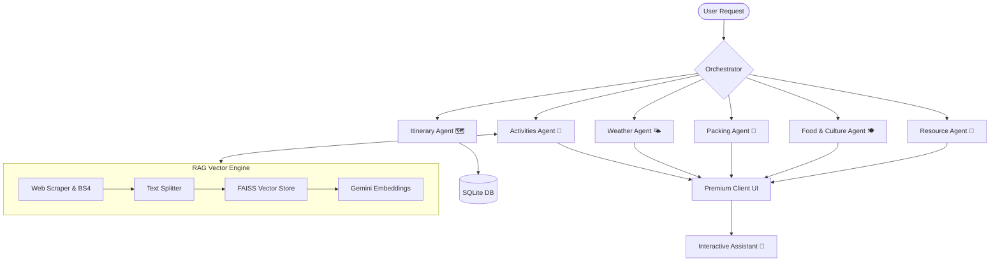

# AI Travel Itinerary Planner (Multi-Agent RAG System)

Welcome to the **AI Travel Itinerary Planner**, a production-grade, modular multi-agent travel orchestration system powered by **RAG (Retrieval-Augmented Generation)**, **LangGraph**, **FastAPI**, and **Next.js**.

The system is built as a **decoupled client-server architecture**:
- **Modern Frontend**: Built with Next.js (React 19) and Tailwind CSS for a glassmorphic dark-mode user experience.
- **Asynchronous Backend API**: Powered by FastAPI, exposing modular API endpoints to control and orchestrate the multi-agent graph.
- **Multi-Agent RAG Engine**: Orchestrated via LangGraph, LangChain, Google Gemini API (`gemini-3.6-flash`), and local LLMs (Ollama `llama3.2`) with fallbacks. Features real-time web scraping, text chunking, and in-memory **FAISS vector indexing** with `GoogleGenerativeAIEmbeddings`.
- **Data Persistence**: Integrates SQLite for session tracking and database synchronization.

---

## 🗺️ System Architecture

The workflow leverages a directed acyclic graph (DAG) structure using **LangGraph** where agents act as specialized state-updating nodes, augmented with live web RAG vector search:



### Specialized Agents:
1. **Itinerary Agent (`generate_itinerary.py`)**: Drafts structured daily schedules (morning, afternoon, evening activities, and transportation options).
2. **Activities Agent with Web RAG (`recommend_activities.py`)**: Dynamically scrapes live travel blogs/sites for destination hidden gems, indexes text chunks into FAISS using Gemini embeddings, and retrieves contextual highlights for activity recommendations.
3. **Weather Agent (`weather_forecaster.py`)**: Anticipates destination weather patterns and provides travel recommendations.
4. **Packing Agent (`packing_list_generator.py`)**: Generates custom baggage check-lists tailored to local weather, trip duration, group size, and activity types.
5. **Food & Culture Agent (`food_culture_recommender.py`)**: Provides culinary suggestions, cultural etiquettes, and top local delicacies.
6. **Resource Agent (`fetch_useful_links.py`)**: Fetches highly rated web guides and booking resources using Serper API.
7. **Trip Assistant Chat Agent (`chat_agent.py`)**: Provides interactive, context-aware conversational support over the generated itineraries.

---

## 📁 Directory Structure

```text
MultiAgents-with-Langgraph-TravelItineraryPlanner-main/
│
├── backend/                  # FastAPI Backend Service
│   ├── agents/               # Modular AI Agent Implementations
│   │   ├── chat_agent.py
│   │   ├── fetch_useful_links.py
│   │   ├── food_culture_recommender.py
│   │   ├── generate_itinerary.py
│   │   ├── itinerary.py
│   │   ├── packing_list_generator.py
│   │   ├── recommend_activities.py  # RAG-enabled activity recommendation node
│   │   └── weather_forecaster.py
│   │
│   ├── core/                 # Core System Initializations
│   │   ├── auth.py           # Authentication utilities
│   │   ├── llm.py            # Gemini & Ollama LLM provider & fallback wrapper
│   │   └── rag.py            # Live web scraping, FAISS indexing & embedding retriever
│   │
│   ├── models/               # Database Schemas & Initialization (SQLAlchemy)
│   │   └── database.py
│   │
│   ├── schemas/              # Pydantic Schemas for Request & Response
│   │   └── travel.py
│   │
│   ├── main.py               # FastAPI Server Entry point
│   └── orchestrator.py       # LangGraph Workflows & State Graph Definition
│
├── frontend/                 # Next.js Client Interface
│   ├── src/
│   │   └── app/              # App Router Pages & Styles
│   │       ├── globals.css   # Custom Glassmorphism & Tailwind CSS rules
│   │       ├── layout.tsx    # App Shell & Providers
│   │       └── page.tsx      # Main Dashboard & Form Interface
│   │
│   ├── package.json          # Node Dependencies & Scripts
│   ├── tsconfig.json         # TypeScript Configuration
│   └── next.config.ts        # Next.js Configuration
│
├── requirements.txt          # Python Dependencies
├── .env                      # Global environment credentials (ignored)
├── travel_app.db             # Local SQLite Database (ignored)
└── README.md                 # Project documentation
```

---

## 🚀 Setup & Installation

### Prerequisites
- **Python**: version `3.10+` recommended.
- **Node.js**: version `18+` recommended (for Next.js frontend).
- **Gemini API Key**: Free API key from [Google AI Studio](https://aistudio.google.com/).
- **Serper API Key**: Free search scraping credential at [serper.dev](https://serper.dev/).
- **Ollama** *(Optional for local LLM fallback)*: running locally with `llama3.2`.
  ```bash
  ollama pull llama3.2
  ```

---

### Step 1: Environment Configuration
Create a `.env` file in the root directory:
```env
GEMINI_API_KEY=your_google_gemini_api_key
SERPER_API_KEY=your_google_serper_api_key
OPENAI_API_KEY=your_openai_api_key # (Optional if using OpenAI models)
OLLAMA_BASE_URL=http://localhost:11434
OLLAMA_MODEL=llama3.2
DATABASE_URL=sqlite:///./travel_app.db
```

### Step 2: Install Python Dependencies
```bash
pip install -r requirements.txt
```

### Step 3: Start the Backend API
Run the FastAPI development server:
```bash
python -m backend.main
# or
uvicorn backend.main:app --reload --port 8000
```
*The interactive Swagger UI documentation will be available at `http://localhost:8000/docs`.*

### Step 4: Run the Next.js Frontend
Open a new terminal window, navigate to `frontend/`, install Node dependencies, and start the development server:
```bash
cd frontend
npm install
npm run dev
```
*Open your browser and navigate to `http://localhost:3000` to interact with the dashboard.*

---

## 🛠️ Diagnostics & Benchmarks

Diagnostic utilities are provided to verify integration and test execution performance:

1. **Backend Integration Diagnostics (`diagnose_backend.py`)**:
   Tests the API routing layer and agent state graph execution:
   ```bash
   python diagnose_backend.py
   ```
2. **Performance Benchmarking (`test_itinerary_perf.py`)**:
   Measures time consumption, network overhead, and response generation throughput across all asynchronous LangGraph agents:
   ```bash
   python test_itinerary_perf.py
   ```

---

## 🌟 Key Features

- **Live Web RAG Pipeline**: Scrapes destination blog posts in parallel, chunks content, and builds an on-the-fly FAISS vector index with `GoogleGenerativeAIEmbeddings` for grounded travel recommendations.
- **Resilient Multi-LLM Orchestration**: Primary execution on Google Gemini (`gemini-3.6-flash`) with seamless fallback to local Ollama (`llama3.2`).
- **Glassmorphic Responsive UI**: Dynamic interactive controls with trip customization (party size, travel style, custom comments, budget).
- **Interactive Trip Assistant**: Context-aware chatbot trained on generated trip itineraries for instant Q&A.
- **Persistent State**: Archived session history in SQLite.
